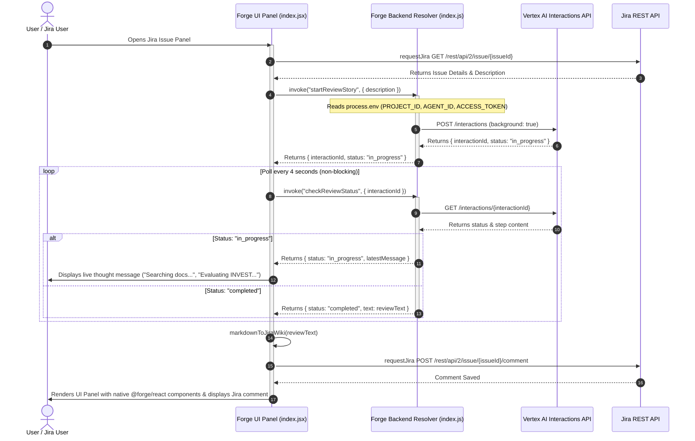

# Antigravity Agent Architecture

This document describes the sequence of calls between the **Jira UI**, **Forge Backend Resolvers**, **Google Vertex AI Interactions API**, and the **Jira REST API**.

## Sequence Diagram

## Architectural Design Highlights

1. **Non-Blocking Invocations:**  
   The initial `startReviewStory` call returns in `< 1s` with an `interactionId`. Polling calls `checkReviewStatus` also return in `< 1s`. Neither call ever hits Atlassian Forge's hard 25-second function execution limit.

2. **Live Agent Progress Feed:**  
   While `status === 'in_progress'`, the frontend polls every 4 seconds and displays real-time agent thoughts in the UI panel.

3. **Rich Text & Wiki Markup Rendering:**  
   - **UI Panel:** Renders native `@forge/react` UI Kit components (`Heading`, `List`, `CodeBlock`).
   - **Jira Comments:** Converts Markdown to Jira Wiki Markup (`h3.`, `*bold*`, `{code}`) for native rich text rendering in issue comments.
