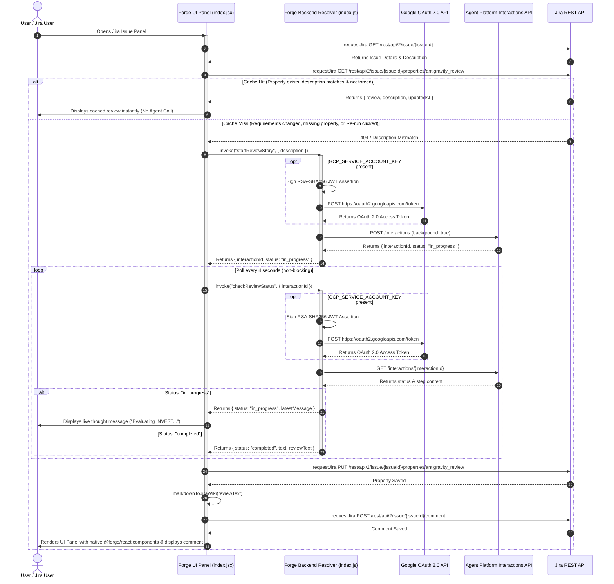

<!--
Copyright 2026 Google LLC

Licensed under the Apache License, Version 2.0 (the "License");
you may not use this file except in compliance with the License.
You may obtain a copy of the License at

http://www.apache.org/licenses/LICENSE-2.0

Unless required by applicable law or agreed to in writing, software
distributed under the License is distributed on an "AS IS" BASIS,
WITHOUT WARRANTIES OR CONDITIONS OF ANY KIND, either express or implied.
See the License for the specific language governing permissions and
limitations under the License.
-->

# Antigravity Agent Architecture

This document describes the sequence of calls between the **Jira UI**, **Forge Backend Resolvers**, **Google OAuth 2.0 Service**, **Agent Platform Interactions API**, and the **Jira REST API**.

## Sequence Diagram

## Architectural Design Highlights

1. **Description-Aware Issue Property Caching:**  
   The panel checks Jira Issue Properties (`antigravity_review`) before invoking the agent. If the cached description matches current issue requirements, the review loads instantly from storage. If requirements change or "Re-run Agent Review" is clicked, it automatically triggers a fresh agent evaluation.

2. **Server-Side Dynamic GCP Authentication:**  
   Backend resolvers dynamically sign an RSA-256 JWT assertion using `GCP_SERVICE_ACCOUNT_KEY` and exchange it with `https://oauth2.googleapis.com/token` for non-expiring OAuth 2.0 access tokens. Fallback to `ACCESS_TOKEN` is supported.

3. **Non-Blocking Execution & Polling:**  
   The initial `startReviewStory` call sets `background: true` and returns in `< 1s` with an `interactionId`. Polling via `checkReviewStatus` fetches progress thoughts without ever exceeding Forge's 25-second limit.

4. **Rich Text & Wiki Markup Rendering:**  
   - **UI Panel:** Renders native `@forge/react` components (`Heading`, `List`, `CodeBlock`, `Stack`, `Button`, `Inline`).
   - **Jira Comments:** Converts Markdown to Jira Wiki Markup (`h3.`, `*bold*`, `{code}`) for native rich comment rendering.

---

## 🏛️ Component Breakdown

| Component | Technology | Primary Responsibilities |
| :--- | :--- | :--- |
| **Frontend UI Panel** | `@forge/react`, `@forge/bridge` | Renders issue panel, manages cache state, detects requirement changes, polls resolvers, renders UI Kit components, and displays "Re-run Agent Review" button. |
| **Backend Resolvers** | `@forge/resolver`, `@forge/api`, `crypto` | Executes server-side RSA-256 JWT signing, exchanges assertions for OAuth access tokens, calls Agent Platform API, and handles non-blocking interaction polling. |
| **Jira REST API** | Jira Cloud REST API v2 | Fetches issue details, reads/writes `antigravity_review` issue properties, and posts formatted Jira Wiki Markup comments. |
| **Google Agent Platform** | Agent Platform API | Executes managed AI agent reasoning steps, streams execution thoughts, and produces story requirement reviews. |

---

## 🔒 Security & Egress Architecture

- **Encrypted Secret Isolation:** `GCP_SERVICE_ACCOUNT_KEY` and `ACCESS_TOKEN` are stored in encrypted Forge secret storage and are only accessible inside backend FaaS resolver functions. No private keys or access tokens are ever exposed to the client browser.
- **Strict External Egress:** Declared explicitly under `permissions.external.fetch.backend` in `manifest.yml` and restricted to `aiplatform.googleapis.com` and `oauth2.googleapis.com`.
