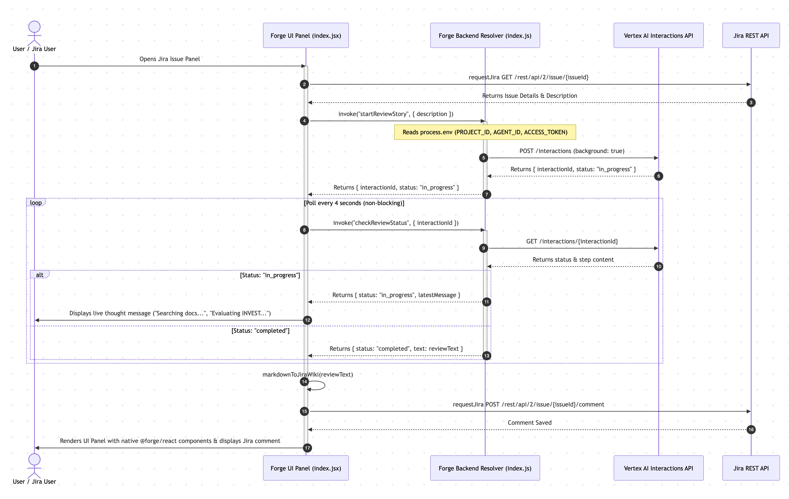

# Antigravity Agent - Forge Jira Issue Panel App

**Antigravity Agent** is an Atlassian Forge app that automatically reviews Jira story requirements using the **Google Vertex AI Interactions API**. It provides real-time progress feedback in a Jira issue panel and publishes comprehensive requirement reviews directly as native Jira issue comments.

---

## 🚀 Features

- **Automated Story Requirement Reviews:** Fetches issue details and evaluates story requirements using Google Vertex AI Agents.
- **Non-Blocking Architecture:** Uses background interaction execution and polling to stay well under Forge's 25-second function timeout limit.
- **Live Thought Stream:** Periodically polls for agent updates and renders real-time execution thoughts directly in the issue panel UI.
- **Native Rich Text Comments:** Converts Markdown reviews into Jira Wiki Markup (`h3.`, `*bold*`, `{code}`) to post formatted comments to Jira issues.
- **Forge UI Kit Rendering:** Built with `@forge/react` UI Kit components (`Heading`, `List`, `CodeBlock`, `Stack`) for a clean native Atlassian experience.

---

## 🛠️ Architecture



For a detailed sequence diagram and breakdown of component interactions (Jira UI Panel $\rightarrow$ Forge Backend Resolvers $\rightarrow$ Vertex AI Interactions API $\rightarrow$ Jira REST API), see [ARCHITECTURE.md](./ARCHITECTURE.md).

---

## 📋 Prerequisites & Configuration

Create new Forge application. [Create a Forge app](https://developer.atlassian.com/platform/forge/getting-started/#build-your-first-forge-app)

### Environment Variables

Create Forge API token here [Create an API token](https://id.atlassian.com/manage/api-tokens)

```bash
export FORGE_EMAIL=YOUR_EMAIL
export FORGE_API_TOKEN=YOUR_API_TOKEN
```

Check that you are logged in with:

```bash
forge whoami
```

```bash
export PROJECT_ID="your-project-id"
export AGENT_ID="your-agent-id" # "projects/123456789/locations/global/agents/agent-name"
export ACCESS_TOKEN=$(gcloud auth application-default print-access-token)
```

The backend resolver requires the following Forge environment variables to authenticate with Google Vertex AI:

```bash
forge variables set --encrypt ACCESS_TOKEN <your-vertex-access-token>
forge variables set AGENT_ID <your-vertex-agent-id>
forge variables set PROJECT_ID <your-gcp-project-id>
```

### Manifest Permissions & Egress

The app requires:
- **Jira Scopes:** `read:jira-work`, `write:jira-work`
- **External Egress:** `aiplatform.googleapis.com` (configured under `permissions.external.fetch.backend` in `manifest.yml`)

---

## 🚦 Getting Started

### 1. Install Dependencies
```bash
npm install
```

### 2. Lint & Validate Manifest
```bash
forge lint
```

### 3. Deploy the App
Deploy the app to your development environment:
```bash
forge deploy
```

### 4. Install on Jira Site
Install the app to your Atlassian site:
```bash
forge install
```

### 5. Local Tunneling (Development)
Run local tunneling to hot-reload frontend and resolver changes:
```bash
forge tunnel
```

---

## 📁 Project Structure

```
Antigravity-Agent/
├── ARCHITECTURE.md       # Sequence diagram and design notes
├── README.md             # Project documentation
├── manifest.yml          # Forge app manifest & permissions
├── package.json          # Node dependencies & metadata
└── src/
    ├── frontend/
    │   └── index.jsx     # Forge UI Kit issue panel component
    └── resolvers/
        └── index.js      # Forge backend resolvers for Interactions API
```
